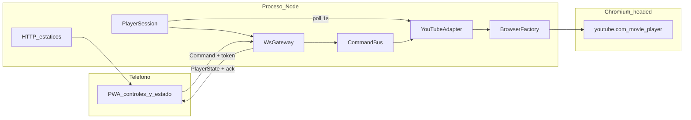

# YouTube Remote Control — Arquitectura y plan por etapas

> **For agentic workers:** REQUIRED SUB-SKILL: Use superpowers:subagent-driven-development (recommended) or superpowers:executing-plans to implement this plan task-by-task. Steps use checkbox (`- [ ]`) syntax for tracking.

**Goal:** Teléfono controla YouTube en la netbook y muestra el estado real del player.

**Architecture:** Un proceso Node. El teléfono nunca habla con Playwright. YouTube vive solo detrás de `YouTubeAdapter`. Comandos absolutos, cola de a uno, estado en RAM.

**Tech Stack:** ver sección Stack concreto abajo.

## Stack concreto (esto queda fijo)

No hay una API REST de `POST /play`. El servidor expone **poco HTTP** y **un WebSocket** que es el API real del control remoto.

### Por qué no REST (y qué es entonces)

REST modela **recursos** con HTTP: `GET /videos/abc`, `PATCH /player` con `{ "playing": true }`. Cada acción es un request nuevo: el cliente pregunta, el server responde, la conexión se cierra.

Este producto no es un CRUD. Es un **control remoto en tiempo real**:

- El teléfono **empuja comandos** (`play`, `seek`) que no son entidades: son intenciones sobre un único player.
- El server **empuja estado** todo el tiempo (tiempo, título, `playing`), incluso cuando el comando no vino del teléfono (pausaste en la netbook).
- Hace falta **reconexión** y **acks** sobre un canal que sigue abierto.

Eso es un **protocolo de mensajes sobre WebSocket** (command / ack / state), no REST. Más cerca de RPC o de un event bus que de una API de recursos.

HTTP sigue existiendo, pero solo para lo que HTTP hace bien:

- `GET /` y estáticos: entregar la PWA
- `GET /health`: “¿el proceso está vivo?”

Los comandos **no** van en `POST /play`. Van como JSON por el socket:

```text
telefono  --command-->  netbook
telefono  <--ack------  netbook
telefono  <--state-----  netbook   (continuo, ~1s, a todos los clientes)
```

Si más adelante alguien quiere REST, sería un adaptador extra (`POST /commands` que internamente encola en el mismo `CommandBus`). No reemplaza el WebSocket: el estado en vivo no se puede hacer bien con request/response sin long-poll o SSE, y SSE es solo server→client (no sirve para mandar play).

### API (proceso Node en la netbook)

Fastify no es lo más liviano posible (`node:http` + `ws` sería más chico), pero en este hardware **no mueve el aguja**: Chromium+YouTube se come el 90%+. Elegimos Fastify para no reimplementar estáticos, health y el upgrade WebSocket a mano. Sigue siendo TypeScript con tipos oficiales del paquete.

- **Runtime:** Node.js 22 LTS (mínimo 20). TypeScript en el server (`tsx`).
- **HTTP:** [Fastify](https://fastify.dev/) 5 — `GET /health` y estáticos de `web/dist`. Tipos propios; no hace falta `@types/fastify`.
- **WebSocket:** `@fastify/websocket` — handshake con `AUTH_TOKEN`, mensajes `command` / `ack` / `state`.
- **Estáticos:** `@fastify/static` sirve `web/dist` (PWA ya compilada).
- **Config:** `dotenv` + `src/config.ts` (`PORT`, `AUTH_TOKEN`, `USER_DATA_DIR`, `PLAYBACK_QUALITY`).
- **Browser:** Playwright (Chromium headed, perfil persistente). **Este** es el costo grande.
- **Dev:** `tsx` para correr TypeScript sin build de server en la netbook.
- **Test:** Vitest (un solo runner para server y módulos de la PWA). Fastify se testea con `app.inject()`. WebSocket: server en puerto efímero + cliente `ws`.
- **No entra:** Express, Nest, Redis, Postgres, GraphQL, REST de comandos, Docker, `node:http` a mano, Bun, Jest. YouTube.com no corre en CI.

El “API” que consume el teléfono es el contrato de `[src/protocol.ts](src/protocol.ts)`, no un OpenAPI de recursos.

Ahorro real de recursos (en orden): un solo Chromium, 480p + h264ify, sin Docker, Mint liviano, HDD→SSD.

### Frontend (PWA en el teléfono)

JS solo en el browser **no** es la mejor opción: el teléfono perdería `Command` / `PlayerState` y habría que duplicar el contrato a mano.

- **TypeScript vanilla + Vite.** Misma idea que “una pantalla estática”, con tipos. Sin React, Vue, Angular ni Astro.
- **Por qué no Astro:** Astro es un generador de sitios (páginas, markdown, islas). El remoto es una sola UI cliente que habla WebSocket. Astro no aporta el canal ni los tipos compartidos; suma SSG que no usamos. Vite + TS es “Astro sin el framework de sitios”.
- **Tipos compartidos:** `[src/protocol.ts](src/protocol.ts)` es puro (tipos + `parseVideoId`). El server y `web/` lo importan. Un solo contrato.
- **Build en la PC, no en el Celeron:** `npm run build:web` (Vite) genera `web/dist`. En la netbook, Fastify solo sirve ese dist. `npm start` no corre Vite.
- **PWA:** `manifest.webmanifest` (Add to Home Screen). Service worker **no** en v1.
- **Habla con el server:** `WebSocket` nativo, mensajes tipados con el protocolo.
- **No entra:** Astro, React, Vue, Tailwind, Capacitor, app Android. Tampoco JS sin tipos en `web/`.

Dev en la PC: Vite para la UI, `tsx` para Node. Deploy en la netbook: artefactos ya buildeados + `npm start`.

## Arquitectura (esto queda fijo)

Tres máquinas lógicas, dos físicas:

- **Teléfono:** PWA. Solo UI + protocolo. No sabe de Playwright ni de `movie_player`.
- **Netbook / proceso Node:** transporte, auth, cola, estado, adapter, browser driver.
- **Netbook / Chromium:** youtube.com en el monitor VGA. Perfil persistente.



### Capas y responsabilidades (un archivo, una razón)

- `[web/](web/)` — PWA en TypeScript (Vite). UI en HTML/CSS; la lógica WS vive en `web/remote-client.ts` (testeable sin DOM). Importa `src/protocol.ts`. No contiene reglas de YouTube.
- `[src/http.ts](src/http.ts)` — sirve la PWA y `GET /health`.
- `[src/ws-gateway.ts](src/ws-gateway.ts)` — handshake del token, clientes conectados, envía ack y broadcast de estado.
- `[src/auth.ts](src/auth.ts)` — compara `AUTH_TOKEN`. Nada más.
- `[src/protocol.ts](src/protocol.ts)` — único contrato: `Command`, `PlayerState`, mensajes WS, parseo de `watch?v=` → id.
- `[src/command-bus.ts](src/command-bus.ts)` — cola FIFO, un comando en vuelo, idempotencia por `command.id`.
- `[src/player-session.ts](src/player-session.ts)` — estado en RAM, poll, diff, avisa al gateway.
- `[src/youtube-adapter.ts](src/youtube-adapter.ts)` — **única** pieza que conoce YouTube: `play()`, `pause()`, `seek()`, `volume()`, `fullscreen()`, `playVideo()`, `readState()`.
- `[src/browser.ts](src/browser.ts)` — `launchPersistentContext`, extensiones, ventana. No conoce comandos.
- `[src/config.ts](src/config.ts)` / `[src/index.ts](src/index.ts)` — env y boot.

Regla DRY: si YouTube cambia, se toca el adapter (y sus tests). El resto del sistema sigue hablando `play()` / `PlayerState`.

En etapas 0–1 el adapter es un `FakeAdapter` in-memory con la misma interfaz. A partir de la etapa 3, `YouTubeAdapter` lo reemplaza. El bus y la PWA no cambian.

### Flujos

**Comando (teléfono → netbook):** PWA envía `{ type: "command", id, name, payload }` → gateway valida token → bus encola → adapter ejecuta → ack al emisor → el próximo poll emite `PlayerState` a todos.

**Estado (netbook → teléfono):** cada ~1s `readState()`; si cambió (tiempo redondeado a 1s), broadcast a todas las PWA. Si pausás con el teclado de la netbook, el teléfono se entera por este camino, no porque el comando haya ido al revés.

**Comandos absolutos:** `play` siempre reproduce, `pause` siempre pausa. Nunca toggle. Así el retry post-reconnect no invierte el estado.

### Contrato

```ts
type CommandName =
  | "play"
  | "pause"
  | "seek"
  | "volume"
  | "fullscreen"
  | "playVideo";

type Command = {
  type: "command";
  id: string;
  name: CommandName;
  payload?: {
    seconds?: number;
    volume?: number;
    videoId?: string;
    url?: string;
  };
};

type PlayerState = {
  playing: boolean;
  title: string;
  videoId: string;
  currentTime: number;
  duration: number;
  volume: number;
  adPlaying: boolean;
  quality: string;
  error?: string;
};
```

Ack: `{ type: "ack", id, ok, error? }`. Mismo `id` reenviado → mismo ack (últimos N).

### Restricciones que la arquitectura ya asume

- Un proceso, nativo, sin Docker/DB/Redis. Estado en RAM.
- Solo LAN, `ws://`, `AUTH_TOKEN` en `.env`.
- Chromium headed + perfil persistente; login de YouTube a mano una vez.
- Control via `movie_player` (`page.evaluate`), no clicks CSS.
- 480p forzado; uBlock + h264ify (Bay Trail no aguanta VP9).
- Hardware: Celeron N2806, 4 GB, HDD, VGA ~1680×1050. No 1080p.

## Testing (práctica de primera, no un extra)

Este proyecto es bueno para aprender a testear **porque las capas ya están separadas**. Si el comando y YouTube vivieran en el mismo `socket.on("play")`, sería un infierno. El FakeAdapter y `protocol.ts` puro existen también para poder practicar TDD.

### Las herramientas y el testing

- **TypeScript +** `protocol.ts` **puro:** el mejor terreno. Sin I/O. TDD clásico (test rojo → código → verde).
- **Vitest:** un runner para server y cliente. Watch, coverage, mocks, fake timers (backoff de reconnect). Es lo que vas a ver en el ecosistema TS; `node:test` es más “stdlib” pero peor para aprender.
- **Fastify HTTP:** ninguna librería extra. Fastify trae `app.inject()` (por debajo light-my-request, ya viene con Fastify). No SuperTest, no axios de test.
- **WebSocket (**`@fastify/websocket`**):** `inject()` no abre un socket real. Se hace `app.listen({ port: 0 })` y se conecta el paquete `ws`. FakeAdapter para no tocar YouTube.
- **Vite / PWA:** la UI (botones, CSS) casi no se testea en v1. La lógica (`conectar`, `enviar comando`, `backoff`, aplicar `PlayerState`) va en `web/remote-client.ts` con un `WebSocket` inyectable. Ahí sí hay tests. No Testing Library: no hay React.
- **Playwright:** dos usos distintos, no mezclarlos.
  1. **Producto:** Chromium headed + YouTube en la netbook.
  2. **Test:** página local `tests/fixtures/fake-player.html` con un `movie_player` falso. El adapter se prueba contra ese HTML, **no** contra youtube.com. Headless, en la PC.
- **YouTube real:** verificación manual en hardware (criterio de hecho de cada etapa 3+). No es un test automatizado. Flaky, lento, HDD, ToS.

### Pirámide (los conceptos son los de siempre)

Unit / integration / e2e **no cambian de significado**. Cambia solo el recorte de _este_ sistema:

- **Unitario:** una unidad, sin I/O real, colaboradores reemplazados. Acá: `parseVideoId`, `CommandBus` con FakeAdapter, `auth`, `remote-client` con un WebSocket falso. Vitest.
- **Integración:** varias piezas **reales** cableadas, pero no el producto entero. Acá hay dos:
  1. Fastify de verdad + WS + FakeAdapter (`inject` para HTTP; `listen` + `ws` para el socket).
  2. `YouTubeAdapter` + Playwright headless + HTML local con `movie_player` falso. Eso **no** es e2e: no hay teléfono, no hay youtube.com, no hay VGA.
- **E2E:** el camino del usuario de punta a punta. Acá sería: PWA en el teléfono → Fastify → Playwright → youtube.com en el VGA. Eso es **manual en la netbook**. No se automatiza: flaky, lento, ToS, HDD.

`app.inject()` no vuelve unitario un test de HTTP: estás integrando tu ruta con Fastify real, sin abrir puerto. Sigue siendo integración, más barata.

Un test de Playwright contra youtube.com sería e2e (o peor: e2e flaky de un tercero). Por eso no va en CI.

Cada etapa 0–1 y 3–4 **empieza por el test que falla**, después el código. `npm test` (Vitest) se corre en la PC. La netbook no es la máquina de CI.

### Qué no hacer para “aprender testing”

- Un E2E que abre YouTube y hace click. Enseña flake, no diseño.
- Snapshot de toda la PWA. No enseña el protocolo.
- Mockear Fastify entero. Testeá _tu_ gateway contra Fastify real + FakeAdapter.

## Plan por etapas

Cada etapa termina en algo que se puede usar o demostrar. No se arranca la siguiente si la anterior no pasa su criterio de hecho.

### Etapa 0 — Contrato y cola (sin red, sin UI)

**Para qué:** fijar nombres y reglas antes de enchufar sockets.

**Files:** `[src/protocol.ts](src/protocol.ts)`, `[src/command-bus.ts](src/command-bus.ts)`, tests.

- [ ] Tests primero: parser `playVideo` (URL `watch?v=` o id de 11 chars); bus: segundo comando espera; `id` duplicado no reejecuta.
- [ ] Implementar `protocol.ts` + `command-bus.ts` hasta que Vitest esté verde.
- [ ] Criterio de hecho: `npm test` verde en protocol + bus.
- [ ] Commit: `feat: add command protocol and serial command bus`

### Etapa 1 — Transporte LAN con player falso

**Para qué:** el teléfono ya es un control remoto. Playwright todavía no existe. Acá se practica auth, reconnect visual y broadcast.

**Files:** `[src/auth.ts](src/auth.ts)`, `[src/http.ts](src/http.ts)`, `[src/ws-gateway.ts](src/ws-gateway.ts)`, `[src/player-session.ts](src/player-session.ts)`, `[src/fake-adapter.ts](src/fake-adapter.ts)`, `[src/index.ts](src/index.ts)`, `[web/](web/)`

- [ ] Tests primero: `inject` de `/health`; WS sin token rechaza; con token acepta; `play` contra FakeAdapter → `ack` + `state`; dos clientes reciben el mismo broadcast.
- [ ] HTTP sirve `web/dist`; `GET /health`.
- [ ] `FakeAdapter`: play/pause/seek/volume/playVideo mutan estado en RAM.
- [ ] PWA: token, botones, URL, muestra `PlayerState`. Lógica WS en `web/remote-client.ts` con tests de backoff (fake timers).
- [ ] Criterio de hecho: `npm test` verde + desde el teléfono, play/pause cambian el estado simulado. Dos pestañas ven lo mismo.
- [ ] Commit: `feat: add LAN websocket PWA with fake player`

### Etapa 2 — Chromium headed en el monitor

**Para qué:** el browser del “televisor” existe, con las extensiones que esta CPU necesita. Todavía no se habla con YouTube.

**Files:** `[src/browser.ts](src/browser.ts)`, `[src/config.ts](src/config.ts)`, `[extensions/](extensions/)`, `[scripts/setup-display.sh](scripts/setup-display.sh)`

- [ ] `launchPersistentContext` headed, `USER_DATA_DIR`, uBlock + h264ify.
- [ ] Script xrandr: VGA ~1680×1050 primary, `DISPLAY=:0`.
- [ ] Criterio de hecho: `npm start` abre Chromium en el VGA, extensiones activas, perfil sobrevive un restart. La PWA de la etapa 1 sigue funcionando contra el fake.
- [ ] Commit: `feat: launch persistent headed Chromium with uBlock and h264ify`

### Etapa 3 — Estado realtime de YouTube (aún sin controlar)

**Para qué:** el teléfono refleja lo que pasa en el monitor. Primer contacto con `movie_player`. Si pausás en la netbook, el teléfono se actualiza.

**Files:** `[src/youtube-adapter.ts](src/youtube-adapter.ts)`, `[src/player-session.ts](src/player-session.ts)`

- [ ] Tests primero contra `tests/fixtures/fake-player.html`: `readState()` lee título/tiempo/`playing`.
- [ ] `readState()` via `page.evaluate` sobre `movie_player`.
- [ ] Poll 1s + broadcast si hay diff.
- [ ] Abrir un `watch?v=` por config o una sola vez a mano en Chromium (manual, no CI).
- [ ] Player ausente / diálogo → `state.error` visible en la PWA.
- [ ] Criterio de hecho: tests del fixture verdes + en la netbook, pausar a mano se refleja en la PWA.
- [ ] Commit: `feat: broadcast live YouTube player state to the PWA`

### Etapa 4 — play / pause reales

**Para qué:** el loop completo del producto mínimo: teléfono → adapter → YouTube → estado de vuelta.

**Files:** `[src/youtube-adapter.ts](src/youtube-adapter.ts)`, cableado bus → adapter real (apagar FakeAdapter).

- [ ] Tests primero en el fixture: `play()` / `pause()` llaman `playVideo` / `pauseVideo` del fake `movie_player`.
- [ ] Cablear bus → adapter real (FakeAdapter queda para tests de WS).
- [ ] Criterio de hecho: fixture verde + play/pause desde el teléfono mueven el VGA.
- [ ] Commit: `feat: control YouTube play and pause via movie_player`

### Etapa 5 — seek, volume, fullscreen

**Para qué:** el control remoto deja de ser on/off.

**Files:** `[src/youtube-adapter.ts](src/youtube-adapter.ts)`, `[web/](web/)`

- [ ] `seekTo`, `setVolume`, fullscreen (player `requestFullscreen` o tecla `f` sobre el player; no locators de barra).
- [ ] PWA: slider de tiempo, volumen, botón fullscreen.
- [ ] Criterio de hecho: seek y volumen se ven en el monitor y vuelven en `PlayerState`.
- [ ] Commit: `feat: add seek volume and fullscreen commands`

### Etapa 6 — Elegir video desde el teléfono + 480p

**Para qué:** ya no hace falta tipear la URL en la netbook.

**Files:** `[src/youtube-adapter.ts](src/youtube-adapter.ts)`, `[src/protocol.ts](src/protocol.ts)`, `[web/](web/)`

- [ ] `playVideo` → `page.goto(https://www.youtube.com/watch?v=ID)` + `setPlaybackQualityRange` 480p.
- [ ] Criterio de hecho: pegar un link en el teléfono carga el video en el VGA a 480p; CPU/HDD no se van a 1080 Auto.
- [ ] Commit: `feat: play YouTube videos from phone URL at 480p`

### Etapa 7 — Endurecer el sistema distribuido chico

**Para qué:** reconexión, retries y anuncios, que era la parte de laboratorio.

**Files:** `[src/command-bus.ts](src/command-bus.ts)`, `[src/ws-gateway.ts](src/ws-gateway.ts)`, `[src/youtube-adapter.ts](src/youtube-adapter.ts)`, `[web/](web/)`

- [ ] Tests: reconnect PWA reenvía comandos no-ack; `id` duplicado no reejecuta; fixture con `adPlaying`; player ausente → `state.error`.
- [ ] Reconnect PWA con backoff; reenviar comandos no-ack; ids idempotentes.
- [ ] `adPlaying` en el estado; no mentir si uBlock pierde.
- [ ] Error accionable: “hay un diálogo en la netbook” (consent/age). Login de Google sigue siendo manual.
- [ ] Criterio de hecho: tests verdes + cortar WiFi del teléfono 10s y volver; pausar durante un ad no deja la UI mentida.
- [ ] Commit: `feat: harden reconnect idempotency and player error states`

## Fuera de estas etapas (v1.1+)

Search scrape o YouTube Data API, next/previous, Docker, Tailscale, persistencia, métricas, app Android. No entran hasta que la etapa 7 esté estable en el hardware real.

## Cómo se prueba en la netbook (a partir de etapa 2)

```bash
npm install && npx playwright install chromium
cp .env.example .env
./scripts/setup-display.sh
npm test
npm start
```

Teléfono en la misma WiFi: `http://<ip-netbook>:<port>`, pegar token.

## Operación de hardware (no es feature)

- Mint XFCE (evitar Cinnamon). Swap 2 GB. Un solo Chromium.
- Login YouTube a mano la primera vez en el Chromium de Playwright.
- Si se traba: `PLAYBACK_QUALITY=360p`, no HD.
- SSD es la mejora de hardware #1, antes que 1080p.
